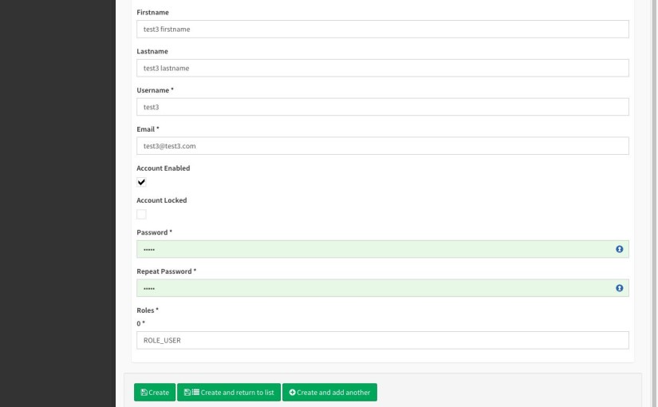
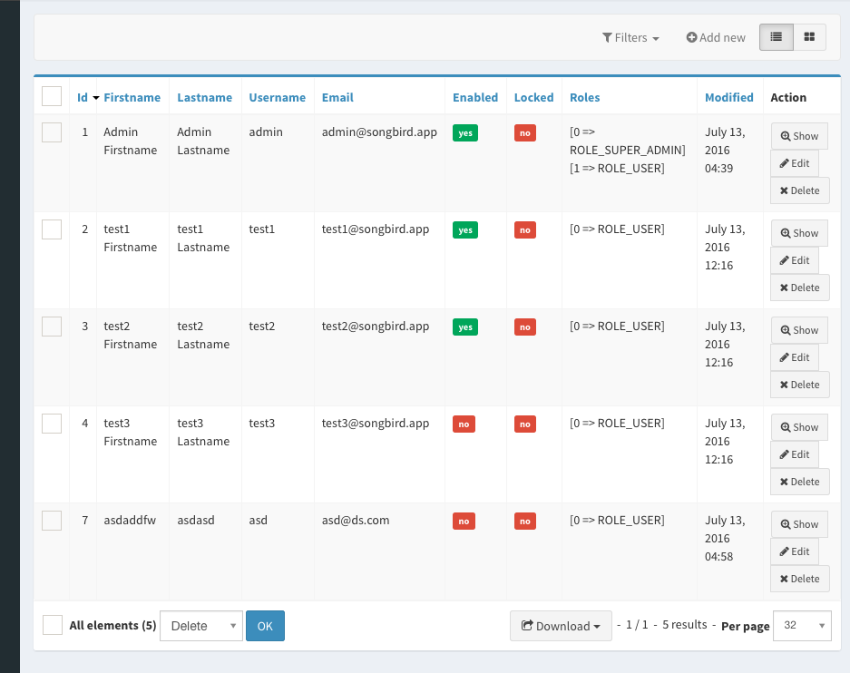

# Chapter 9: The Admin Panel Part 1

We have used FOSUserBundle to create a User CRUD in the previous chapters. It's looking ugly at the moment but its functional. However, anyone can access the user management if they have the right url. We need an admin area where administrators can login and manage the users. All administrative activities should happen behind the admin url, something along the lines of /admin/users for example.

Again, we will try to simplify the process by reusing a 3rd party module that others have created. [SonataAdmin](https://github.com/sonata-project/SonataAdminBundle) and [EasyAdmin](https://github.com/javiereguiluz/EasyAdminBundle) are quite popular at the moment. SonataAdmin is more advanced but complex to setup. In this book, we will be using EasyAdmin to build the admin panel.

It wouldn't be fun if we just use the ready made solution. In this and the next few chapters, we will attempt to build up the admin area bit by bit.

## Objectives

> * Install EasyAdminBundle
> * Integrate FOSUserBundle and EasyAdminBundle
> * Filtering the User fields
> * Redirecting Users to Dashboard After Login
> * User Roles and Security
> * Cleaning Up

## Pre-setup

Make sure we are in the right branch. Let us branch off from the previous chapter.

```
# check your branch
-> git status
# start branching now
-> git checkout -b my_chapter9
```

## Install EasyAdminBundle

As usual, let us add the required bundles in the composer.json file

```
# composer.json

"require": }
    ....
    "javiereguiluz/easyadmin-bundle": "^1.15"
    ....
```

then run composer update

```
-> composer update

# if composer is playing up with memory issues
# php -d memory_limit=-1 path_to_composer update
```

and remember to activate the required bundles in AppKernel.php

```
# app/AppKernel.php
...
    public function registerBundles()
    {
        $bundles = array(
            // ...
            new JavierEguiluz\Bundle\EasyAdminBundle\EasyAdminBundle(),
        );
    }
...
```

Create a new easyadmin config file

```
# app/config/easyadmin/user.yml

easy_admin:
    entities:
        User:
            class: AppBundle\Entity\User

```

The main config file then needs to load everything under the easyadmin folder

```
# app/config/config.yml
imports:
    - { resource: parameters.yml }
    - { resource: security.yml }
    - { resource: services.yml }
    - {resource: easyadmin/ }
...
```
and routing file

```
# app/config/routing.yml
...
easy_admin_bundle:
    resource: "@EasyAdminBundle/Controller/"
    type:     annotation
    prefix:   /admin
```

If everything goes well, there will be new routes added

```
-> app/console debug:router | grep admin
   easyadmin                        ANY        ANY      ANY    /admin/
   admin                            ANY        ANY      ANY    /admin/
```

We will install the default styles from the bundle

```
app/console assets:install
```

Now, try logging in

```
http://songbird.app/app_dev.php/admin
```

By default, the admin page requires ROLE_ADMIN and above (see app/config/security.yml). So let us login as the administrator

```
username: admin
password: admin
```

wow, we can now see the admin dashboard. If you have accidentally deleted or modified the admin user, remember that you can reset the db with the "scripts/resetapp" script.


Looks pretty empty huh?

## Integrate FOSUserBundle and EasyAdminBundle

Create a new admin controller

```
#src/AppBundle/Controller/AdminController.php
namespace AppBundle\Controller;

use JavierEguiluz\Bundle\EasyAdminBundle\Controller\AdminController as BaseAdminController;

class AdminController extends BaseAdminController
{
    public function createNewUserEntity()
    {
        return $this->get('fos_user.user_manager')->createUser();
    }

    public function prePersistUserEntity($user)
    {
        $this->get('fos_user.user_manager')->updateUser($user, false);
    }

    public function preUpdateUserEntity($user)
    {
        $this->get('fos_user.user_manager')->updateUser($user, false);
    }
}
```

services.yml is important because that is where the dependency injection happens. Without it, we can't hook additional services to our bundle.
Let us create a dummy one for now.

```
# src/AppBundle/Resources/config/services.yml

services:
    # note that this name is important. Its how we reference the class throughout the site.
```

Next, we need to create the a yml [service extension](http://symfony.com/doc/current/cookbook/bundles/extension.html) and the configuration class so that the framework can load it during the bootstrap.

```
-> mkdir -p src/AppBundle/DependencyInjection
-> touch AppExtension.php
```

and AppExtensions.php contains

```
# src/AppBundle/DependencyInjection/AppExtension.php

namespace AppBundle\DependencyInjection;

use Symfony\Component\DependencyInjection\ContainerBuilder;
use Symfony\Component\Config\FileLocator;
use Symfony\Component\HttpKernel\DependencyInjection\Extension;
use Symfony\Component\DependencyInjection\Loader\YamlFileLoader;

/**
* This is the class that loads and manages your bundle configuration
*
* To learn more see {@link http://symfony.com/doc/current/cookbook/bundles/extension.html}
*/
class AppExtension extends Extension
{
    /**
     * {@inheritdoc}
     */
    public function load(array $configs, ContainerBuilder $container)
    {
        $configuration = new Configuration();
        $config = $this->processConfiguration($configuration, $configs);

        $loader = new YamlFileLoader($container, new FileLocator(__DIR__ . '/../Resources/config'));
        $loader->load('services.yml');
    }
}
```

now the configuration file

```
# src/AppBundle/DependencyInjection/Configuration.php

namespace AppBundle\DependencyInjection;

use Symfony\Component\Config\Definition\Builder\TreeBuilder;
use Symfony\Component\Config\Definition\ConfigurationInterface;

/**
 * This is the class that validates and merges configuration from your app/config files
 *
 */
class Configuration implements ConfigurationInterface
{
    /**
     * {@inheritdoc}
     */
    public function getConfigTreeBuilder()
    {
        $treeBuilder = new TreeBuilder();
        $treeBuilder->root('app');

        // Here you should define the parameters that are allowed to
        // configure your bundle. See the documentation linked above for
        // more information on that topic.

        return $treeBuilder;
    }
}
```

## Filtering the User fields

The user table has many fields. Remember that you specified what fields you want to display in src/AppBundle/Form/UserType.php? By using EasyAdmin, the creation of forms is now managed by the config. It should be self explanatory. Let us modify the fields.

```
# app/config/easyadmin/user.yml

easy_admin:
    entities:
        User:
            class: AppBundle\Entity\User
            label: 'User Management'
            # for new user
            new:
                fields:
                  - username
                  - firstname
                  - lastname
                  - { property: 'plainPassword', type: 'repeated', type_options: { type: 'Symfony\Component\Form\Extension\Core\Type\PasswordType', first_options: {label: 'Password'}, second_options: {label: 'Repeat Password'}, invalid_message: 'The password fields must match.'}}
                  - { property: 'email', type: 'email', type_options: { trim: true } }
                  - roles
                  - enabled
            edit:
                  fields:
                    - username
                    - firstname
                    - lastname
                    - { property: 'plainPassword', type: 'repeated', type_options: { type: 'Symfony\Component\Form\Extension\Core\Type\PasswordType', required: false, first_options: {label: 'Password'}, second_options: {label: 'Repeat Password'}, invalid_message: 'The password fields must match.'}}
                    - { property: 'email', type: 'email', type_options: { trim: true } }
                    - roles
                    - enabled
                    - locked
                    - expired
            list:
                title: 'User Listing'
                fields:
                  - id
                  - username
                  - email
                  - firstname
                  - lastname
                  - last_login
                  - enabled
                  - locked
                  - expired
                  - roles
                  - { property: 'last_login', type: 'datetime', format: 'j/n/Y' }
```

We have trimed down all the fields to include only the relevant ones. The preUpdate function allows us to perform our own tasks like encrypting the password before the actual update function is called.

Now if you click on the "create" link in the User Admin block, you will only see the important fields. Let us fill in the form with random values and click "create and return to list".



Another thing to note is the configureFormFields function. I have added a few fields (enabled, locked, roles) that are only editable by the super admin.

Now look at the list view



Everything is looking good. Looking at adminer, you can see that the password has also been encrypted correctly, indicating that the preUpdate function is working.


## Redirecting Users to Dashboard After Login

Easy.

```
# app/config/security.yml
...
    firewalls:
        main:
            pattern: ^/
            form_login:
                provider: fos_userbundle
                csrf_provider: security.csrf.token_manager
                default_target_path: /admin
                ...
```

## User Roles and Security

At the moment, normal user cannot login to the admin area. What if we want ROLE_USER to login to /admin as well and restrict them to certain areas only? That is where [security handlers](https://sonata-project.org/bundles/admin/master/doc/reference/security.html) come in.

In our case, we will use the role handler rather than acl to handle user access. We need to activate the handler in the config file.

```
# app/config/config.yml
...
# role login
sonata_admin:
    security:
        handler: sonata.admin.security.handler.role
...
```

Say for now, we want ROLE_USER to access the admin dashboard but not the user management section.

```
# app/config/security.yml
...
    access_control:
        - { path: ^/login$, role: IS_AUTHENTICATED_ANONYMOUSLY }
        # We do not allow user registration
        # - { path: ^/register, role: IS_AUTHENTICATED_ANONYMOUSLY }
        - { path: ^/resetting, role: IS_AUTHENTICATED_ANONYMOUSLY }
        - { path: ^/admin/, role: ROLE_USER }
```

Try logging in again as test1:test1 and you should see a plain dashboard.

Now say we like test1 user to be able to view and edit his own profile but not other users? Firstly, we need to give ROLE_USER access right to view and edit the users.

To get the user admin service:

```
-> app/console sonata:admin:list

Admin services:
  songbird.admin.user         AppBundle\Entity\User
```

Now, add the service under the ROLE_USER section in the security file

```
# app/config/security.yml
...
role_hierarchy:
        ROLE_USER:
            # in this format: ROLE_service_name_in_underscore_ACTION
            - ROLE_SONGBIRD_ADMIN_USER_VIEW
            - ROLE_SONGBIRD_ADMIN_USER_EDIT
...
```

Then, we need some custom logic to filter the users. We can override the parent's CRUD functions but this is an ugly solution. How can we do that elegantly?

What we will do here is to create an [event listener](http://symfony.com/doc/current/cookbook/event_dispatcher/event_listener.html) to listen to events that are fired by the Sonata Admin (You can see all the events in Sonata\AdminBundle\Event\AdminEventExtension.php). We want to hook on to the sonata.admin.event.configure.form (for edit and create route) and sonata.admin.event.configure.show event (for read route).

Now in services.yml file, we can do something like that

```
# src/AppBundle/Resources/config/services.yml
...
    songbird.admin.user.show.filter:
        class: AppBundle\EventListener\UserCustomAction
        tags:
            - { name: kernel.event_listener, event: sonata.admin.event.configure.show, method: sonataAdminCheckUserRights }

    songbird.admin.user.form.filter:
        class: AppBundle\EventListener\UserCustomAction
        tags:
            - { name: kernel.event_listener, event: sonata.admin.event.configure.form, method: sonataAdminCheckUserRights }
...
```

We are trying to call the AppBundle\EventListerner\UserCustomAction::sonataAdminCheckUserRights function every time the sonata.admin.event.configure.form and sonata.admin.event.configure.show events are dispatched.

```
# src/AppBundle/EventListener/UserCustomAction.php

namespace AppBundle\EventListener;

use Sonata\AdminBundle\Event\ConfigureEvent;
use Symfony\Component\Security\Core\Exception\AccessDeniedException;

class UserCustomAction
{

    /**
     * show an error if user is not superadmin and tries to manage other user details
     *
     * @param  ConfigureEvent $event sonata admin event
     * @return null
     */
    public function sonataAdminCheckUserRights(ConfigureEvent $event)
    {
        // ignore this if user is admin
        if ($event->getAdmin()->isGranted('ROLE_SUPER_ADMIN')) {
            return;
        }

        $user_id = $event->getAdmin()->getRequest()->attributes->all()['id'];
        // we can get container from ->getAdmin()->getConfigurationPool()->getContainer()
        $session_id = $event->getAdmin()->getConfigurationPool()->getContainer()->get('security.token_storage')->getToken()->getUser()->getId();
        if ($user_id != $session_id) {
            throw new AccessDeniedException();
        }
    }
}
```

In UserCustomAction.php, we try to match the user session id and the id of the user in the url. Unless the user is a super admin, we throw an access denied error when the user is trying to access someone else profile.

Try logging in as test1:test1 (user id = 2) annd access other people profile like so

```
http://songbird.app/app_dev.php/admin/app/user/1/show
http://songbird.app/app_dev.php/admin/app/user/3/show
```

or view the user list url

```
http://songbird.app/app_dev.php/admin/app/user/list
```

You should get an access denied error. If however, test1 is trying to access his own profile

```
http://songbird.app/app_dev.php/admin/app/user/2/show
```

everything should be ok.

How do you see all the routes available? remember the magic command?

```
-> app/console debug:router
```

<h2>Cleaning Up</h2>

Now let us do some cleaning up. Since we are now using SonataAdmin, a lot of files that we have generated using the command line are no longer needed. As you can see, automation is only good if you know what you are doing.

```
git rm src/AppBundle/Controller/UserController.php
git rm src/AppBundle/Form/UserType.php
git rm -rf src/AppBundle/Tests/Controller/UserControllerTest.php
# All efforts gone? Don't worry, we will write new tests in the next chapter
git rm -rf tests
git rm codeception.yml
# add all changes
git add .
```

Since we are no longer using FOSUserBundle /profile url to change update user profile, let us remove it from the routing.yml

```
# app/config/routing.yml

#fos_user_profile:
#    resource: "@FOSUserBundle/Resources/config/routing/profile.xml"
#    prefix: /profile

#fos_user_change_password:
#    resource: "@FOSUserBundle/Resources/config/routing/change_password.xml"
#    prefix: /profile
```

## Summary

We have installed a popular Admin system called SonataAdminBundle. We then integrated FOSUserBundle with SonataAdminBundle and customised some fields. We have also configured the security of the system such that unless the logged in user is a super admin, the user can only update his own profile.

Remember to commit your changes before moving on to the next chapter.

Next Chapter: [Chapter 10: BDD with Codeception (Optional)](https://github.com/bernardpeh/songbird/tree/chapter_10)

Previous Chapter: [Chapter 8: Fixtures, Fixtures, Fixtures](https://github.com/bernardpeh/songbird/tree/chapter_8)


## Stuck? Checkout my code

```
-> git checkout -b chapter_9 origin/chapter_9
-> git clean -fd
```

## Exercises

* Try installing the [SonataAdminBundle](https://sonata-project.org/bundles/admin/master/doc/index.html) yourself and see the differences in both approach.

## References

* [EasyAdminBundle](https://github.com/javiereguiluz/EasyAdminBundle)

* [EasyAdminBundle and FOSUserBundle Integration](https://github.com/javiereguiluz/EasyAdminBundle/blob/master/Resources/doc/tutorials/fosuserbundle-integration.md)

* [EasyAdminBundle views configuration](https://github.com/javiereguiluz/EasyAdminBundle/blob/master/Resources/doc/book/4-edit-new-configuration.md#customizing-the-behavior-of-edit-and-new-views)
