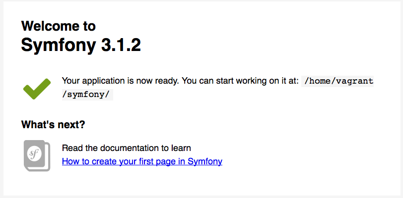

# Chapter 3: Creating the Dev Environment

So that we speak the same language throughout the book, we need a dev (development) environment that it is consistent in everyone's host. That best way to do that is to create a virtual machine (VM) via [vagrant](https://www.vagrantup.com). This is a popular technique nowadays and we will be using [Homestead](https://github.com/laravel/homestead) for this purpose.

The idea is to do **actual coding in your host** (main operating system) and let the VM run the web server, sharing the web folder between the 2 machines. Note that 99% of the time, you don't need to touch the VM except to make sure that it is up and running.

## Objectives

> * Install all pre-requisites for development.

> * Configure your host to access the VM.

## Installation

* In your host machine, make sure you have php say [php 5.6](http://php.net/manual/en/install.php) and timezone configured, [vagrant](https://www.vagrantup.com/downloads.html), [virtualbox](https://www.virtualbox.org/wiki/Downloads), [composer](https://getcomposer.org/doc/00-intro.md) and [git](https://git-scm.com) **installed**.

* Mac users can install php 5.6 using

```
-> curl -s http://php-osx.liip.ch/install.sh | bash -s 5.6
-> echo "export PATH=/usr/local/php5/bin:$PATH" >> ~/.profile
-> sudo vi /usr/local/php5/php.d/99-liip-developer.ini
# add the date.timezone settings to your preferred timezone. eg
# date.timezone = Australia/Melbourne
# then shutdown the terminal and restart again
```

* If you are on Windows OS install [NFS support plugin](https://github.com/GM-Alex/vagrant-winnfsd)

* Login in [github](http://github.com) and [fork](https://help.github.com/articles/fork-a-repo/) [SongBird repo](https://github.com/bernardpeh/songbird)

```
# Now you want to clone your new forked repo under your home dir.
-> cd ~
-> git clone git@github.com:your_username/songbird.git
```

* run vagrant

```
# now we are going to bring up the virtual machine. This should take about 30 mins depending on your internet connnection. Have a cup of coffee.

-> vagrant up

# you will be prompted to enter admin password for mounting nfs.
...
```

* You can now install symfony libraries:

```
-> cd symfony
-> composer udpate

# when prompted, leave default settings except for the followings:
# database_host: 192.168.56.111
# database_name: songbird
# database_user: homestead
# database_password: secret
...
# We are using smtp port 8025 to catch all mails.
# mailer_host: 127.0.0.1:8025
...
```

* add IP of your VM to your [host file](http://www.rackspace.com/knowledge_center/article/how-do-i-modify-my-hosts-file)

```
192.168.56.111 songbird.app adminer.app
```

* Open up browser and go to http://songbird.app/. Add the exception in the browser since the vm self-signed the ssl certificate. If you see an installation successful page, you are on the right track.



* Now try this url http://songbird.app/app_dev.php and you should see the same successful page but with a little icon/toolbar at the bottom of the page. That's right, you are now in dev mode. Why the "app_dev.php"? That is like the default page for the dev environment. All url rewrite goes to this page and this is something unique to Symfony.

* Also try http://adminer.app and you should see the adminer page as well.

## Summary

In this chapter, we setup the development environment from a ready made instance of virtualbox (Homestead). We installed Symfony and configured the host to access SongBird from the host machine.

Next Chapter: [Chapter 4: The Testing Framework Part 1](https://github.com/bernardpeh/songbird/tree/chapter_4)

Previous Chapter: [Chapter 2: What is SongBird](https://github.com/bernardpeh/songbird/tree/chapter_2)

## Exercises (Optional)

* Try running Symfony's build-in webserver. What command would you use?

* Try using [docker](https://www.docker.com/) rather than [vagrant](https://www.vagrantup.com) for development. What are the pros and cons of each method?

* How many ways are there to install Symfony?

## References

* [Symfony Installation](https://symfony.com/doc/current/book/installation.html)

* [Homestead with Symfony](http://symfony.com/doc/current/cookbook/workflow/homestead.html)

